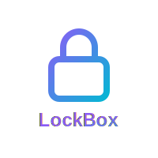

<div align="center">

<picture>
  <source media="(prefers-color-scheme: dark)" srcset="attached_assets/logo-dark.svg">
  <source media="(prefers-color-scheme: light)" srcset="attached_assets/logo-light.svg">
  
</picture>

# 🔐 LockBox

### *Lock the gate, avoid the fate.*

**A real-time encrypted messaging platform for secure private communication**

[](https://replit.com)
[](https://www.typescriptlang.org/)
[](https://reactjs.org/)
[](https://socket.io/)

[Features](#-features) • [Tech Stack](#-tech-stack) • [Getting Started](#-getting-started) • [Security](#-security-model) • [Demo](#-demo)

</div>

---

## 📖 About

LockBox is a modern, real-time messaging application built for private communication between friends. It features encrypted message storage, instant delivery via WebSocket, and a clean, intuitive interface with dark mode support.

> **Note**: This is a demonstration/MVP with simplified encryption. See [Security Model](#-security-model) for important details about encryption implementation.

## ✨ Features

### Core Functionality
- 💬 **Real-time Messaging** - Instant message delivery using Socket.IO
- 🔐 **Encrypted Storage** - Messages encrypted client-side before storage
- 👥 **Private Chats** - 1-on-1 messaging with friends
- 🏛️ **Chatrooms** - Public group conversations with persistent history
- 🗑️ **Message Deletion** - Soft deletion with real-time broadcasts

### User Management
- 🔑 **Secure Authentication** - Replit Auth with Google, GitHub, and email
- 👤 **Profile Management** - Edit name, view account details
- 🟢 **Online Status** - Real-time presence indicators
- 🔍 **Friend Discovery** - Find and connect with other users

### Platform Features
- 🌙 **Dark Mode** - Theme persistence across all pages
- 📱 **Responsive Design** - Works on desktop and mobile
- ⚡ **Session-based Security** - Secure WebSocket authentication
- 👑 **Admin Panel** - User and chatroom management (admin-only)

## 🛠️ Tech Stack

<div align="center">

### Frontend


### Backend


### Tools & Libraries


</div>

## 🚀 Getting Started

### Prerequisites
- Node.js 18+ 
- PostgreSQL database
- Replit account (for authentication)

### Installation

1. **Clone the repository**
   ```bash
   git clone https://github.com/yourusername/lockbox.git
   cd lockbox
   ```

2. **Install dependencies**
   ```bash
   npm install
   ```

3. **Set up environment variables**
   ```bash
   # Copy example env file
   cp .env.example .env
   
   # Configure your .env file with:
   # - DATABASE_URL (PostgreSQL connection string)
   # - SESSION_SECRET (random string for session encryption)
   # - Replit Auth credentials
   ```

4. **Initialize the database**
   ```bash
   npm run db:push
   ```

5. **Start the development server**
   ```bash
   npm run dev
   ```

6. **Open your browser**
   ```
   Navigate to http://localhost:5000
   ```

## 🎮 Demo

### Main Chat Interface
Clean, modern interface with friend list and real-time messaging:
- Select friends from the sidebar to start private conversations
- Join the chatroom for group discussions
- Messages appear instantly with smooth animations
- Online/offline status indicators for all users

### Profile Management
- Edit your display name
- View account details (email, join date, admin status)
- Changes reflect immediately across the entire app

### Admin Panel
For admin users only:
- Manage all platform users
- Create and configure chatrooms
- Promote users to admin
- Monitor online/offline status in real-time

## 🔐 Security Model

### Current Implementation

LockBox uses **client-side AES encryption** for demonstration purposes:

**Private Messages:**
- Encrypted with a shared static key
- Stored and transmitted in encrypted form only
- Basic obfuscation for demo/MVP purposes

**Chatroom Messages:**
- Encrypted with a shared chatroom key
- No plaintext storage in database
- Real-time encrypted delivery

### Important Limitations

⚠️ **This is NOT production-ready encryption:**
- All users share the same encryption keys (hardcoded in client)
- Any user can decrypt any message by inspecting the source code
- Server operator could potentially access plaintext
- No key rotation or perfect forward secrecy

### For Production Use

A production deployment should implement:
- **Asymmetric Encryption** (RSA, Curve25519)
- **Signal Protocol** or similar for true E2E encryption
- **Perfect Forward Secrecy** with ephemeral keys
- **Key Exchange Protocol** (Diffie-Hellman)
- **Identity Verification** with safety numbers

## 📁 Project Structure

```
lockbox/
├── client/                 # Frontend React application
│   └── src/
│       ├── components/     # Reusable UI components
│       ├── hooks/          # Custom React hooks
│       ├── lib/            # Utilities and encryption
│       └── pages/          # Main application pages
├── server/                 # Backend Express server
│   ├── db.ts              # Database configuration
│   ├── routes.ts          # API endpoints
│   ├── storage.ts         # Data access layer
│   └── replitAuth.ts      # Authentication setup
├── shared/                 # Shared types and schemas
│   └── schema.ts          # Database schemas and types
└── attached_assets/        # Static assets and images
```

## 🤝 Contributing

Contributions are welcome! Here's how you can help:

1. **Fork the repository**
2. **Create a feature branch** (`git checkout -b feature/AmazingFeature`)
3. **Commit your changes** (`git commit -m 'Add some AmazingFeature'`)
4. **Push to the branch** (`git push origin feature/AmazingFeature`)
5. **Open a Pull Request**

### Development Guidelines
- Follow the existing code style
- Add tests for new features
- Update documentation as needed
- Keep commits atomic and well-described

## 🐛 Known Limitations

- **Encryption**: Simplified model - not suitable for production security
- **File Sharing**: No support for images or file attachments
- **Read Receipts**: Not implemented
- **Message Editing**: Messages can only be deleted, not edited
- **Voice/Video**: UI buttons present but not functional

## 📝 License

This project is licensed under the MIT License - see the [LICENSE](LICENSE) file for details.

## 🙏 Acknowledgments

- Built with [Replit](https://replit.com)
- UI components from [shadcn/ui](https://ui.shadcn.com)
- Icons from [Lucide](https://lucide.dev)
- Encryption via [crypto-js](https://cryptojs.gitbook.io/)

---

<div align="center">

**Built with ❤️ for secure communication**

[Report Bug](https://github.com/yourusername/lockbox/issues) • [Request Feature](https://github.com/yourusername/lockbox/issues)

</div>
